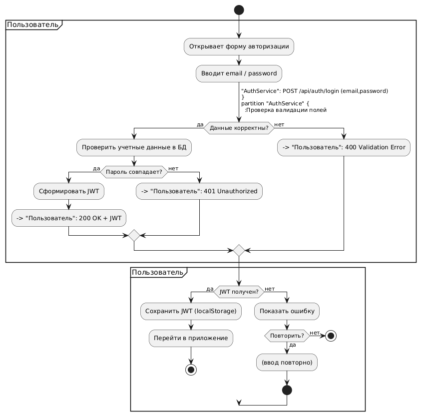
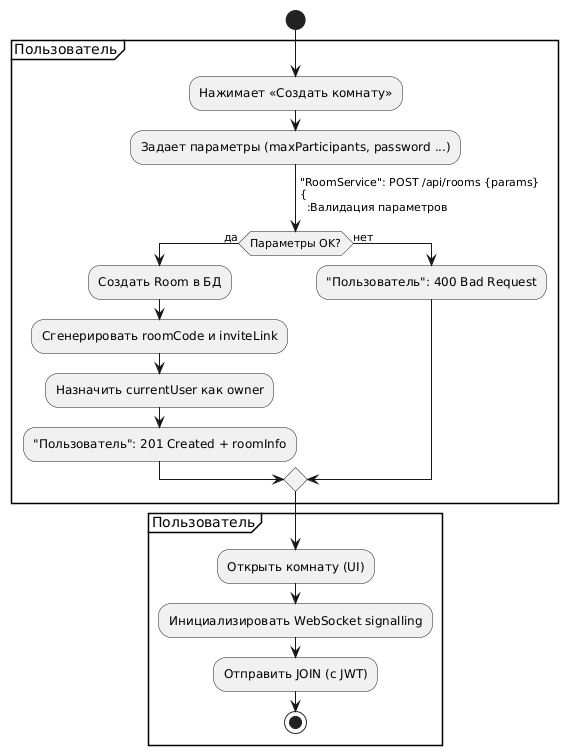
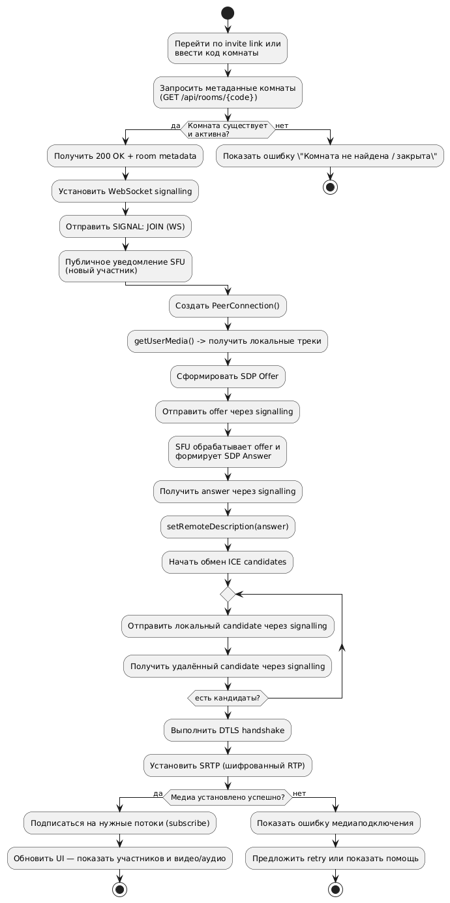
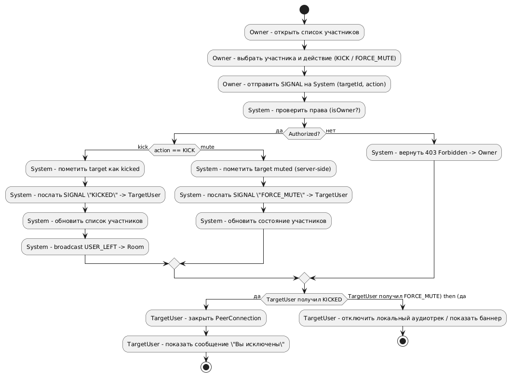
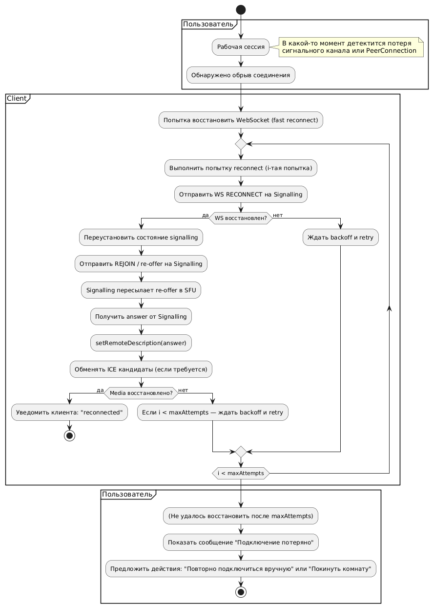

# Диаграммы активностей "CollabRoom"

# Содержание

1. [Аутентификация (Register / Login)](#1)
2. [Создание комнаты](#2)
3. [Присоединение к комнате (signalling / SDP / ICE)](#3)
4. [Управление участниками (Kick / Force‑mute)](#4)
5. [Переподключение / восстановление сессии](#5)

### 1. Аутентификация (Register / Login)

**Краткое описание:**

* Открытие формы, ввод email/password, валидация, запрос к `AuthService`, получение JWT и переход в приложение.

### 2. Создание комнаты

**Краткое описание:**

* Пользователь задаёт параметры комнаты (maxParticipants, пароль), сервер создаёт комнату, генерирует код/ссылку и инициирует signalling.

### 3. Присоединение к комнате (signalling / SDP / ICE)

**Краткое описание:**

* Порядок подключения: проверка существования комнаты, WebSocket signalling, обмен SDP/ICE, установка PeerConnection и запуск медиапотоков (SFU).

### 4. Управление участниками (Kick / Force‑mute)

**Краткое описание:**

* Владелец комнаты отправляет команды (KICK / FORCE_MUTE), сервер проверяет права, рассылает сигналы целевому участнику и обновляет состояние комнаты.

### 5. Переподключение / восстановление сессии

**Краткое описание:**

* Логика автоматического восстановления при потере сети: попытки reconnect, повторный обмен offer/answer и ICE, бэкофф и уведомление пользователя при неудаче.
