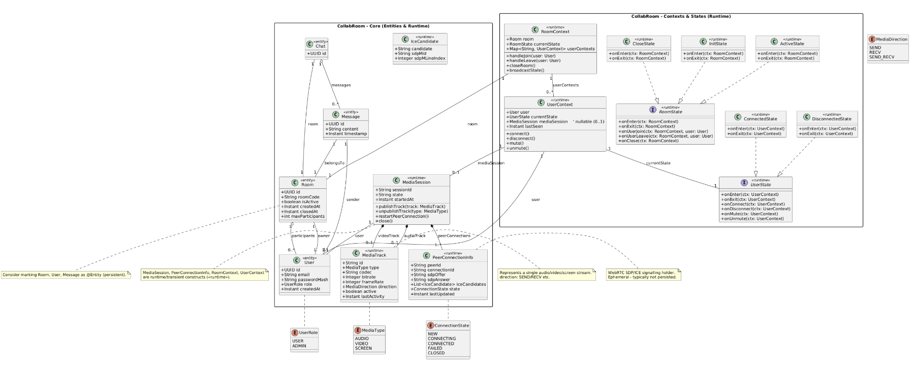

# CollabRoom Glossary

| Термин | Что это | Ключевые поля / Примечание (тип) |
|---|---:|---|
| **User** | Учётная запись пользователя | `id: UUID` \| `email: String` \| `passwordHash: String` \| `role: UserRole` \| `createdAt: Instant`. — **@Entity (persistent)** |
| **Room** | Логическая комната встречи | `id: UUID` \| `roomCode: String` \| `isActive: boolean` \| `createdAt/closedAt: Instant` \| `maxParticipants: int`. — **@Entity (persistent)** |
| **Chat** | Текстовый канал, привязанный к комнате | `id: UUID` \| связь `room: Room` \| `messages: List<Message>`. Может быть агрегатом комнаты. — **@Entity (persistent)** |
| **Message** | Одно текстовое сообщение в чате | `id: UUID` \| `room: Room` \| `sender: User` \| `content: String` \| `timestamp: Instant`. — **@Entity (persistent)** |
| **MediaTrack** | Один медиапоток (аудио/видео/screen) | `id: String` \| `type: MediaType` \| `codec: String` \| `bitrate/frameRate: Integer` \| `direction: MediaDirection` \| `active: boolean` \| `lastActivity: Instant`. — **runtime (transient)** |
| **IceCandidate** | Описание ICE-кандидата для WebRTC | `candidate: String` \| `sdpMid: String` \| `sdpMLineIndex: Integer`. Используется в signalling. — **runtime (transient)** |
| **PeerConnectionInfo** | Хранит SDP/ICE и состояние WebRTC-соединения | `peerId, connectionId: String` \| `sdpOffer/Answer: String` \| `iceCandidates: List<IceCandidate>` \| `state: ConnectionState` \| `lastUpdated: Instant`. — **runtime (transient); обычно не сохраняется** |
| **MediaSession** | Набор медиатреков + peer-connection для одного пользователя | `sessionId: String` \| `user: User` \| `audioTrack/videoTrack: MediaTrack?` \| `peerConnections: List<PeerConnectionInfo>` \| `state: String` \| `startedAt: Instant`. Методы: `publishTrack()`, `unpublishTrack()`, `restartPeerConnection()`, `close()`. — **runtime** |
| **RoomState (interface)** | Интерфейс состояний комнаты (State pattern) | Операции: `onEnter(ctx)`, `onExit(ctx)`, `onUserJoin(ctx, user)`, `onUserLeave(ctx, user)`, `onClose(ctx)`. Реализации: `InitState`, `ActiveState`, `CloseState`. — **runtime** |
| **InitState** | Состояние инициализации комнаты | Поведение при создании/первом входе. Реализует `RoomState`. — **runtime** |
| **ActiveState** | Активная (рабочая) комната | Поведение при обычной работе (join/leave, broadcast). Реализует `RoomState`. — **runtime** |
| **CloseState** | Закрытая комната | Блокирует join; освобождает ресурсы. Реализует `RoomState`. — **runtime** |
| **RoomContext** | Контекст комнаты — держит Room и текущее состояние | `room: Room` \| `currentState: RoomState` \| `userContexts: Map<String, UserContext>`; операции: `handleJoin(user)`, `handleLeave(user)`, `closeRoom()`, `broadcastState()`. — **runtime** |
| **UserState (interface)** | Интерфейс состояний пользователя | Операции: `onEnter(ctx)`, `onExit(ctx)`, `onConnect(ctx)`, `onDisconnect(ctx)`, `onMute(ctx)`, `onUnmute(ctx)`. Реализации: `ConnectedState`, `DisconnectedState`. — **runtime** |
| **ConnectedState** | Состояние подключённого пользователя | Поведение при подключении/публикации потоков. Реализует `UserState`. — **runtime** |
| **DisconnectedState** | Состояние отключённого пользователя | Поведение при выходе/разорванном соединении. Реализует `UserState`. — **runtime** |
| **UserContext** | Контекст пользователя — связывает User и его runtime-состояния | `user: User` \| `currentState: UserState` \| `mediaSession: MediaSession?` \| `lastSeen: Instant`; методы: `connect()`, `disconnect()`, `mute()`, `unmute()`. — **runtime** |
| **MediaType (enum)** | Тип медиапотока | Значения: `AUDIO`, `VIDEO`, `SCREEN`. |
| **ConnectionState (enum)** | Состояние WebRTC-соединения | Значения: `NEW`, `CONNECTING`, `CONNECTED`, `FAILED`, `CLOSED`. |
| **UserRole (enum)** | Роль пользователя | Значения: `USER`, `ADMIN`. |
| **MediaDirection (enum)** | Направление медиатрека | Значения: `SEND`, `RECV`, `SEND_RECV`. |
| **DTOs / WebRTCSignalDTO** | Транспортные объекты для API / signalling | Примеры: `WebRTCSignalDTO { type, from, to, payload }`, `MessageDTO`, `RoomResponseDTO`. DTO сериализуются в JSON и используются в REST/WebSocket. |