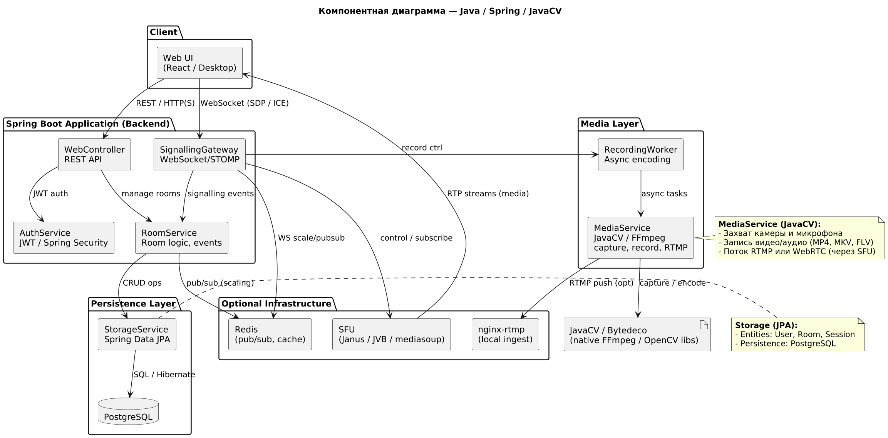
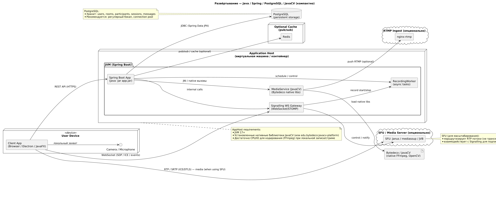

# Диаграмма компонентов и развёртывания — Java / Spring / JavaCV

### Диаграмма компонентов

**Описание компонентов:**
* **WebController (Spring MVC / WebFlux)** — REST-контроллеры приложения.
* **SignallingGateway (WebSocket / STOMP)** — канал сигналинга (OFFER/ANSWER/CANDIDATE и события комнаты).
* **AuthService (Spring Security + JWT)** — аутентификация/авторизация.
* **RoomService** — бизнес-логика комнат и управление участниками.
* **MediaService (JavaCV / Bytedeco)** — захват, кодирование, локальная запись и RTMP-пуш.
* **Recorder / RecordingWorker** — асинхронная обработка и сохранение медиаконтента.
* **Storage (Spring Data JPA)** — PostgreSQL для персистентных данных.
* **Optional: Redis, SFU, nginx-rtmp** — инфраструктурные компоненты для масштабирования медиа.

### Диаграмма развёртывания

**Описание развёртывания:**
* Приложение разворачивается в JVM (Spring Boot) и использует нативные бинари JavaCV/Bytedeco для работы с FFmpeg/OpenCV.
* PostgreSQL хранит данные (пользователи, комнаты, сессии).
* При высокой нагрузке WebSocket и signalling можно масштабировать с Redis (pub/sub) и отдельными инстансами SFU.
* Для RTMP-инжеста / локального тестирования можно запускать `nginx-rtmp` на отдельном хосте или локально.
