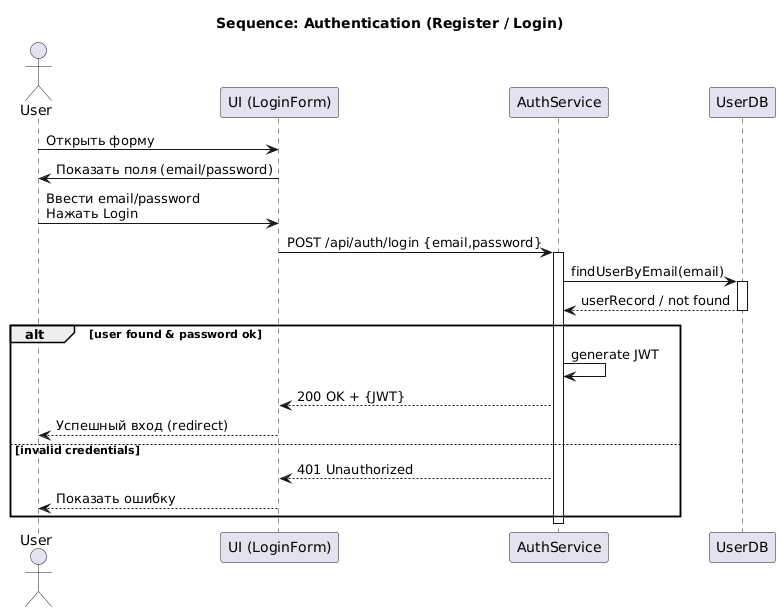
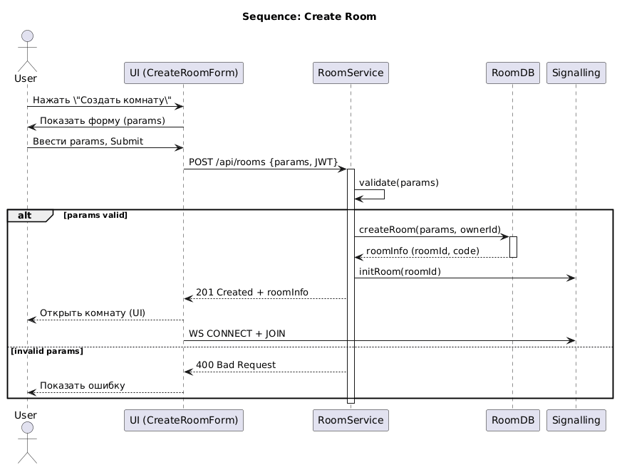
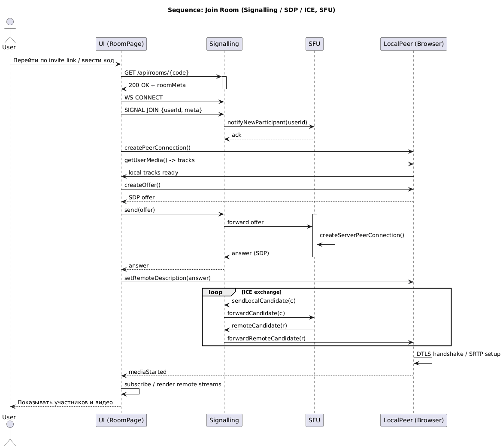
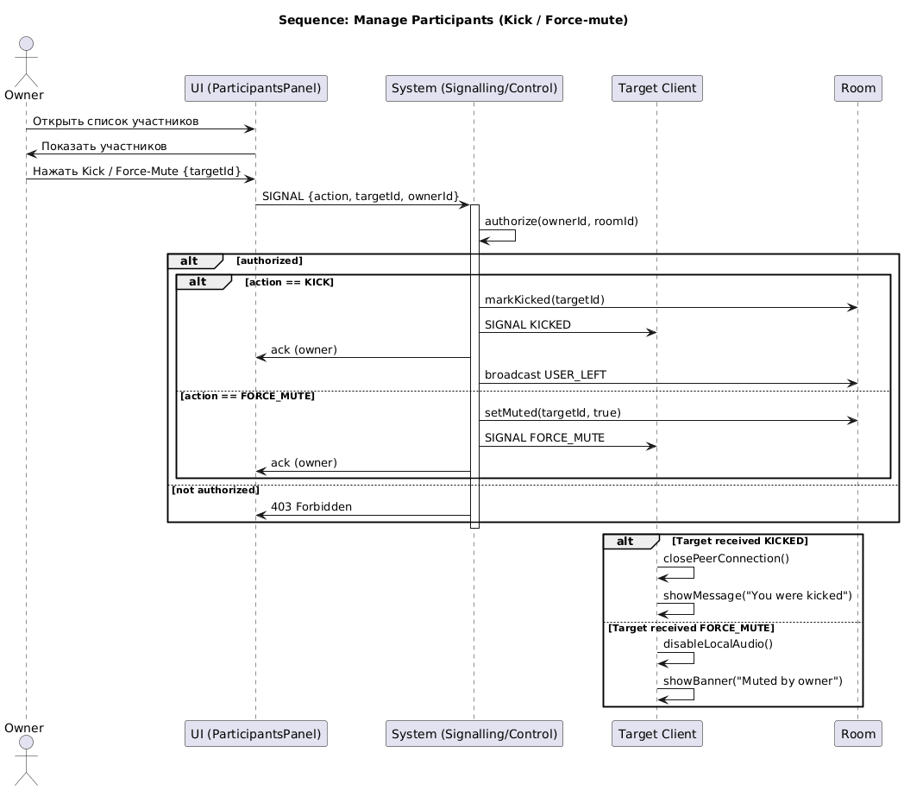
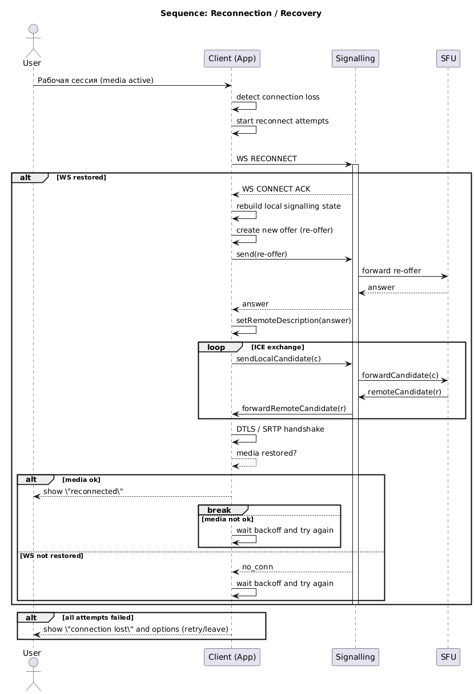

# Диаграммы последовательностей "CollabRoom / Momentum"

# Содержание
1. [Аутентификация (Register / Login)](#1)
2. [Создание комнаты](#2)
3. [Присоединение к комнате (signalling / SDP / ICE)](#3)
4. [Управление участниками (Kick / Force-mute)](#4)
5. [Переподключение / восстановление сессии](#5)

### 1. Аутентификация (Register / Login)

### 2. Создание комнаты

### 3. Присоединение к комнате (signalling / SDP / ICE)

### 4. Управление участниками (Kick / Force-mute)

### 5. Переподключение / восстановление сессии

