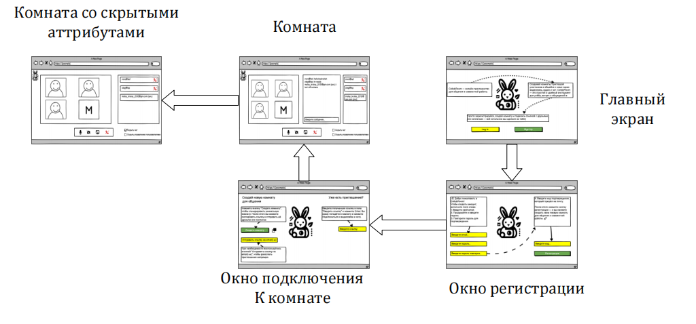

# Диаграммы состояний — **CollabRoom**

Состояния пользовательского интерфейса описывают основные сценарии переходов между экранами и элементами приложения.
Для наглядности используются **мокапы экранов**: авторизация, главный экран, создание/подключение к комнате и интерфейс комнаты (в двух вариантах — со всеми панелями и со скрытым чатом).

---

## 1. Навигация между экранами

Высокоуровневая схема переходов между основными экранами приложения.

| Состояние                          | Описание                                                                           |
| :--------------------------------- | :--------------------------------------------------------------------------------- |
| **Экран авторизации**              | Пользователь вводит логин и пароль, либо проходит регистрацию.                     |
| **Главный экран**                  | После входа отображается список доступных комнат и кнопка `Создать комнату`.       |
| **Создание/Подключение к комнате** | Экран с формой ввода названия комнаты или кода подключения.                        |
| **Комната (все панели)**           | Основное состояние комнаты — активны панели видео, участников, чата, инструментов. |
| **Комната (скрыт чат)**            | Режим, когда чат свернут для увеличения области видео или доски.                   |

| Событие                   | Переход                                            |
| :------------------------ | :------------------------------------------------- |
| Успешная авторизация      | `Авторизация` → `Главный экран`                    |
| Нажатие `Создать комнату` | `Главный экран` → `Создание/Подключение к комнате` |
| Подключение к комнате     | `Создание/Подключение` → `Комната (все панели)`    |
| Нажатие `Скрыть чат`      | `Комната (все панели)` → `Комната (скрыт чат)`     |
| Нажатие `Показать чат`    | `Комната (скрыт чат)` → `Комната (все панели)`     |
| Выход из комнаты          | `Комната (любое состояние)` → `Главный экран`      |
| Выход из аккаунта         | `Главный экран` → `Авторизация`                    |

---

## 2. Взаимодействие внутри комнаты

| Состояние                       | Описание                                                                |
| :------------------------------ | :---------------------------------------------------------------------- |
| **Панель участников открыта**   | Отображаются все активные участники, кнопки пригласить/исключить.       |
| **Панель чата открыта**         | Активна вкладка чата, видны сообщения и поле ввода.                     |
| **Панель инструментов активна** | Доступ к функциям совместного рисования, демонстрации экрана, реакциям. |
| **Мини-режим**                  | Свернуты все панели, остаются только видео и базовое управление.        |

| Событие                   | Переход                                         |
| :------------------------ | :---------------------------------------------- |
| Нажатие `Участники`       | Любое состояние → `Панель участников открыта`   |
| Нажатие `Чат`             | Любое состояние → `Панель чата открыта`         |
| Нажатие `Инструменты`     | Любое состояние → `Панель инструментов активна` |
| Нажатие `Свернуть панели` | Любое состояние → `Мини-режим`                  |

---

## 3. Процесс подключения и выхода из комнаты

| Состояние               | Описание                                                       |
| :---------------------- | :------------------------------------------------------------- |
| **Создание комнаты**    | Пользователь инициирует создание новой комнаты через форму.    |
| **Ожидание участников** | Комната создана, пользователь — хост. Ждёт подключений.        |
| **Активная сессия**     | Все участники подключены, ведётся общение и взаимодействие.    |
| **Выход из комнаты**    | Пользователь покидает комнату, поток и соединения закрываются. |

| Событие                          | Переход                                    |
| :------------------------------- | :----------------------------------------- |
| Нажатие `Создать`                | `Главный экран` → `Создание комнаты`       |
| Комната создана                  | `Создание комнаты` → `Ожидание участников` |
| Подключение других пользователей | `Ожидание участников` → `Активная сессия`  |
| Нажатие `Выйти`                  | `Активная сессия` → `Главный экран`        |
