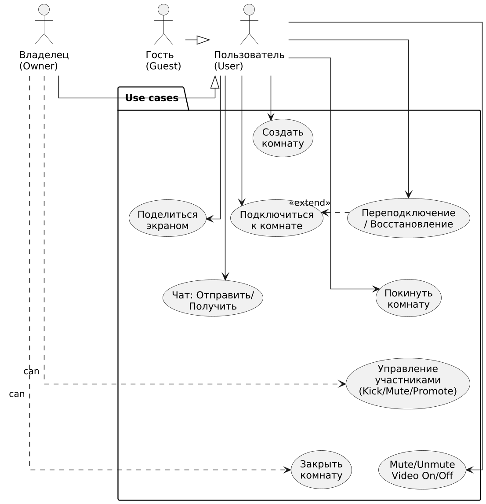

# Глоссарий

| Термин | Определение |
|:--|:--|
| Пользователь | Любой человек, у которого есть аккаунт в CollabRoom (может быть роль `USER` или `ADMIN`) |
| Владелец комнаты (owner) | Пользователь, создавший комнату; обладает правами администратора в этой комнате (удаление участников, закрытие комнаты) |
| Участник (participant) | Пользователь, подключённый к комнате и участвующий в аудио/видео/чате |
| Комната (Room) | Логическая сессия для аудио/видео/чата с уникальным кодом/ссылкой |
| Медиа-сессия (MediaSession) | Набор медиатреков (аудио/видео) и peer-connection info для одного участника |
| PeerConnectionInfo | Сигнальная информация WebRTC (SDP/ICE) для установления соединения |
| MediaTrack | Один медиапоток (audio/video/screen-share) |
| Chat / Сообщение | Текстовый канал комнаты; сообщение содержит отправителя, текст и метку времени |
| RoomContext / UserContext | Runtime-объекты, управляющие состоянием комнаты/пользователя (State pattern) |
| Signalling | Передача SDP/ICE/событий через WebSocket для установки WebRTC-соединений |
| Guest | (опционально) пользователь без аккаунта, входящий по ссылке с ограниченными правами |

# Поток событий
(краткая схема)
1. Пользователь аутентифицируется (или открывает ссылку гостя).
2. Создаёт или присоединяется к комнате.
3. Инициируется сигналинг (WebSocket) — обмен SDP/ICE и создание PeerConnection.
4. Устанавливаются медиапотоки (WebRTC) — участники видят/слышат друг друга.
5. В комнате работает чат и управление устройствами; владелец может управлять участниками.
6. При проблемах — попытка переподключения/рестарта PeerConnection; при закрытии — освобождение ресурсов.

# Содержание
1. [Актёры](#actors)
2. [Варианты использования](#use_case)  
   2.1. [Зарегистрироваться / Войти](#auth)  
   2.2. [Создать комнату](#create_room)  
   2.3. [Подключиться к комнате по ссылке (Join)](#join_room)  
   2.4. [Покинуть комнату (Leave)](#leave_room)  
   2.5. [Управление участниками (Kick / Mute)](#manage_participants)  
   2.6. [Включить/выключить микрофон или камеру (Mute/Unmute / Video On/Off)](#toggle_media)  
   2.7. [Поделиться экраном (Screen Share)](#screen_share)  
   2.8. [Чат (Send/Receive Message)](#chat)  
   2.9. [Переподключение / восстановление сессии (Reconnection)](#reconnect)  
   2.10. [Закрыть комнату (Close room)](#close_room)

<a name="actors"/>

# 1. Актёры

| Актёр | Описание |
|:--|:--|
| Пользователь (User) | Аутентифицированный клиент — создает/участвует в комнатах |
| Владелец комнаты (Owner) | Пользователь, создавший комнату; имеет дополнительные права (удаление участников, закрытие) |
| Гость (Guest) — опционально | Пользователь без аккаунта, приходящий по ссылке; права могут быть ограничены |
| Система (System) | Серверная часть — REST API, WebSocket, signalling, управление состояниями |

<a name="use_case"/>

# 2. Варианты использования

<a name="auth"/>

## 2.1. Зарегистрироваться / Войти

**Описание.** Регистрация и аутентификация пользователя для доступа к функционалу (создание комнат, избранные комнаты и т.д.).  
**Предусловия.** Клиент имеет подключение к интернету.  
**Основной поток.**
1. Пользователь открывает экран регистрации/входа.
2. Для регистрации вводит email и пароль; приложение вызывает `POST /api/auth/register`.
3. Сервер валидирует данные, создаёт запись `User` и возвращает JWT.
4. Пользователь сохраняет токен и попадает в главное приложение.
5. Для входа пользователь вводит email/password; приложение вызывает `POST /api/auth/login` и получает JWT.
6. Вариант использования завершается.

**Альтернативный поток A1 (ошибка валидации).**
1. Если данные некорректны — показывается сообщение об ошибке; форма подсвечивается.
2. Пользователь корректирует данные и повторяет попытку.

<a name="create_room"/>

## 2.2. Создать комнату

**Описание.** Позволяет пользователю создать новую комнату и стать её владельцем.  
**Предусловия.** Пользователь вошёл в систему (аутентифицирован) или использует guest-функцию, если разрешено.  
**Основной поток.**
1. Пользователь нажимает «Создать комнату».
2. Приложение вызывает `POST /api/rooms` (опционально: настройки комнаты — maxParticipants, пароль).
3. Сервер создаёт `Room` с уникальным `roomCode` и возвращает данные комнаты и ссылку-приглашение.
4. Клиент открывает экран комнаты и инициализирует RoomContext и WebSocket-сессию для сигнального канала.
5. Вариант использования завершается — пользователь находится в комнате как owner.

**Альтернативный поток A1 (максимум участников)**
1. Если параметры невалидны (например maxParticipants меньше 2) — показать ошибку и не создавать комнату.

<a name="join_room"/>

## 2.3. Подключиться к комнате по ссылке (Join)

**Описание.** Присоединение пользователя к существующей комнате по коду/ссылке.  
**Предусловия.** У пользователя есть ссылка или код комнаты; комната не закрыта и не переполнена.  
**Основной поток.**
1. Пользователь кликает ссылку/вводит код комнаты.
2. Клиент вызывает `GET /api/rooms/{code}` для проверки комнаты.
3. Сервер возвращает данные комнаты; клиент устанавливает WebSocket соединение (signalling).
4. Клиент отправляет сообщение `JOIN` через WebSocket с идентификатором пользователя.
5. RoomContext регистрирует `UserContext` для нового участника и рассылает `USER_JOINED` всем участникам через WebSocket.
6. Запускается обмен SDP/ICE (OFFER/ANSWER/CANDIDATE) между участниками — создаются PeerConnection / MediaSession.
7. По успешному завершению обмена медиапотоки становятся активными — участник слышит/видит других.
8. Вариант использования завершается — пользователь подключён.

**Альтернативный поток A1 (комната закрыта или переполнена).**
1. Сервер возвращает ошибку; приложение показывает уведомление и не подключает пользователя.

**Альтернативный поток A2 (отказ в доступе — пароль, бан).**
1. Если для комнаты установлен пароль — клиент запрашивает пароль у пользователя и повторяет шаги; при неверном пароле — отказ.

<a name="leave_room"/>

## 2.4. Покинуть комнату (Leave)

**Описание.** Участник выходит из комнаты.  
**Предусловия.** Пользователь подключён к комнате.  
**Основной поток.**
1. Пользователь нажимает «Выйти» или закрывает вкладку.
2. Клиент отправляет сигнал `LEAVE` на сервер через WebSocket.
3. RoomContext удаляет `UserContext`, обновляет список участников и рассылает `USER_LEFT` всем участникам.
4. PeerConnection и MediaSession для данного пользователя закрываются и ресурсы освобождаются.
5. Клиент возвращается на главный экран.
6. Вариант использования завершается.

**Альтернативный поток A1 (автоматическое отключение при потере сети).**
1. При кратковременной потере соединения запускается попытка переподключения (см. Reconnection).
2. Если переподключение не удалось — система считает пользователя покинувшим комнату и выполняет шаги основного потока.

<a name="manage_participants"/>

## 2.5. Управление участниками (Kick / Mute / Promote)

**Описание.** Владелец комнаты может исключать участников, отключать их медиа или повышать роль.  
**Предусловия.** Пользователь — владелец комнаты (owner) и подключён.  
**Основной поток (Kick).**
1. Owner открывает список участников и нажимает «Удалить» напротив участника.
2. Клиент отправляет `KICK` событие на сервер (идентификатор удаляемого участника).
3. Сервер валидирует право владельца и отправляет `KICKED` целевому участнику; целевой участник получает сообщение и локально закрывает MediaSession.
4. RoomContext удаляет UserContext и рассылает обновлённый список участников.
5. Вариант использования завершается.

**Альтернативный поток A1 (Mute).**
1. Owner нажимает «Отключить микрофон» для участника.
2. Сервер отправляет команду `FORCE_MUTE` целевому клиенту; клиент отключает локальный аудиотрек (или браузер/клиент это делает принудительно через сигналинг).
3. Состояние участника помечается как `muted`; уведомления рассылаются.

<a name="toggle_media"/>

## 2.6. Включить/выключить микрофон или камеру (Mute/Unmute / Video On/Off)

**Описание.** Участник управляет собственными медиа-устройствами.  
**Предусловия.** Пользователь подключён к комнате и имеет доступ к устройствам.  
**Основной поток.**
1. Пользователь нажимает кнопку «Микрофон» для переключения состояния.
2. Клиент включает/отключает локальный аудиотрек (`MediaTrack`) и отправляет через WebSocket событие `TRACK_UPDATED` (или `MUTE/UNMUTE`).
3. Сервер/RoomContext пересылает обновление всем участникам; UI обновляет иконку статуса.
4. Вариант использования завершается.

**Альтернативный поток A1 (недоступность устройства / отказ в доступе).**
1. Если браузер отказал в доступе к микрофону/камере — показать диалог с инструкциями по предоставлению доступа.

<a name="screen_share"/>

## 2.7. Поделиться экраном (Screen Share)

**Описание.** Публикация видеопотока экрана пользователя.  
**Предусловия.** Пользователь подключён; браузер поддерживает screen-capture.  
**Основной поток.**
1. Пользователь нажимает «Поделиться экраном».
2. Клиент запрашивает разрешение на захват экрана у пользователя (browser prompt).
3. После согласия создаётся `MediaTrack` типа `SCREEN` и добавляется в `MediaSession` (publishTrack).
4. Через сигналинг сервер/участники узнают о новом треке и подписываются.
5. UI у всех участников отображает экран.
6. Вариант использования завершается.

**Альтернативный поток A1 (несовместимость / отказ).**
1. Если захват экрана невозможен — показать ошибку и инструкции.

<a name="chat"/>

## 2.8. Чат (Отправить / Получить сообщение)

**Описание.** Текстовая коммуникация внутри комнаты.  
**Предусловия.** Пользователь подключён к комнате.  
**Основной поток.**
1. Пользователь вводит текст в поле чата и нажимает «Отправить».
2. Клиент отправляет `CHAT_MESSAGE` через WebSocket (payload: senderId, text, timestamp).
3. Сервер сохраняет сообщение в `Message` (опционально в БД) и ретранслирует его всем участникам комнаты.
4. Клиенты получают сообщение и добавляют его в UI чата.
5. Вариант использования завершается.

**Альтернативный поток A1 (не удалось отправить / оффлайн).**
1. Если WebSocket недоступен — локально кешировать сообщение и попытаться отправить позже или показать ошибку.

<a name="reconnect"/>

## 2.9. Переподключение / восстановление сессии (Reconnection)

**Описание.** Механизм автоматического восстановления после кратковременных сетевых сбоев.  
**Предусловия.** Пользователь был ранее подключён в комнате; потерял соединение.  
**Основной поток.**
1. Клиент обнаруживает потерю WebSocket/RTCPeerConnection и пытается восстановить WebSocket (signalling).
2. После восстановления сигнального канала клиент инициирует процедуру переподключения: re-offer / re-ice.
3. RoomContext и остальные участники обновляют PeerConnectionInfo, соединения восстанавливаются.
4. Если переподключение прошло успешно — состояние пользователя возвращается в `Connected`.
5. Вариант использования завершается.

**Альтернативный поток A1 (неудачное восстановление).**
1. Если переподключиться не удалось в течение таймаута — клиент считает пользователя вышедшим и выполняет leave-flow.

<a name="close_room"/>

## 2.10. Закрыть комнату (Close room)

**Описание.** Owner закрывает комнату, завершая сессию для всех участников.  
**Предусловия.** Owner подключён к комнате.  
**Основной поток.**
1. Owner нажимает «Закрыть комнату».
2. Клиент отправляет `CLOSE_ROOM` на сервер.
3. Сервер переводит `RoomContext` в `CloseState`, рассылает `ROOM_CLOSED` всем участникам и сохраняет (опционально) историю сессии.
4. Все участники получают уведомление и локально закрывают MediaSession / PeerConnection.
5. Room становится неактивной (`isActive=false`).
6. Вариант использования завершается.

**Альтернативный поток A1 (отмена).**
1. Если владелец отменяет действие — комната остаётся активной.

